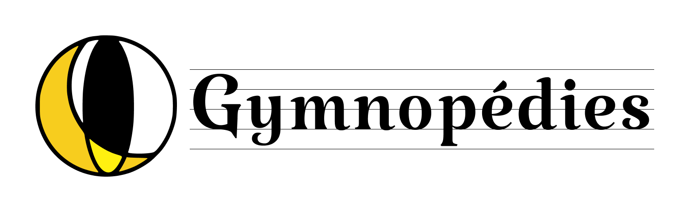

<p align="center">
  
</p>

# Gymnopédies

A **shadcn registry** of dark, serif, glow-leaning React components for
long-form reading experiences — blogs, essays, archives, photo journals.

| | |
| --- | --- |
| 🎛️ **Storybook** | <https://gymnopedies.shoota.work/> — browse every component |
| 📖 **Sample blog** | <https://gymnopedies.shoota.work/examples/blog/> — the components composed into a real site |
| 📦 **Registry** | <https://gymnopedies.shoota.work/r/gymnopedies.json> — the install endpoint |

Forms are intentionally out of scope — gymnopédies is a read-only design system.

## Quick start

gymnopédies is distributed as a [shadcn registry](https://ui.shadcn.com/docs/registry)
and listed in the official [shadcn registry directory](https://ui.shadcn.com/registry)
as **`@gymnopedies`**. The CLI copies component **source** straight into your
project — there is no runtime npm dependency on gymnopédies itself; you own
the code once it lands.

Requirements: a React 18+ project with **Tailwind CSS v4** and the `@/*` tsconfig path alias.
A fresh Vite app set up with shadcn works out of the box:

```bash
# 1. scaffold a shadcn-ready Vite app (skip if you already have a project)
#    -p nova picks a base preset to skip the interactive prompt;
#    gymnopédies overrides the theme either way.
npx shadcn@latest init -b base -t vite -p nova

# 2. install the whole gymnopédies preset
npx shadcn@latest add @gymnopedies/gymnopedies
```

The preset pulls in the theme tokens, every non-form shadcn primitive, the
bespoke blog components and the `use-mobile` hook — and installs their npm
dependencies (`@base-ui/react`, `class-variance-authority`, `lucide-react`,
`date-fns`, …) automatically.

Prefer to cherry-pick? Add items one at a time:

```bash
npx shadcn@latest add @gymnopedies/theme
npx shadcn@latest add @gymnopedies/hero
npx shadcn@latest add @gymnopedies/article
```

Then compose a page — see the [sample blog](https://gymnopedies.shoota.work/examples/blog/)
(source under [`examples/blog/`](./examples/blog)) for a worked example.

## Component catalogue

`src/components/ui/` — 35 shadcn primitives (everything non-form):

| group        | components                                                                                     |
| ------------ | ---------------------------------------------------------------------------------------------- |
| primitives   | button, badge, separator, skeleton, aspect-ratio, avatar, progress                             |
| containers   | card, alert, scroll-area                                                                       |
| navigation   | breadcrumb, pagination, tabs, navigation-menu, menubar                                         |
| overlays     | dialog, alert-dialog, sheet, drawer, popover, hover-card, tooltip, sonner                      |
| menus        | dropdown-menu, context-menu, command                                                          |
| disclosure   | accordion, collapsible                                                                         |
| state/toggle | toggle, toggle-group                                                                           |
| layout       | resizable, sidebar                                                                             |
| data         | table, chart, carousel                                                                         |

`src/components/blog/` — 5 bespoke gymnopédies primitives:

| name              | purpose                                                                                |
| ----------------- | -------------------------------------------------------------------------------------- |
| hero              | full-bleed cover image + over-image title; ships the legacy `lighting` animation       |
| picture           | `<figure>` with grayscale-on-rest / reveal-on-hover image; compound API w/ `Caption`   |
| content           | article paragraph container; auto-spaces adjacent siblings; styles embedded images     |
| date-time         | `<time>` with date-fns formatting (default `MMMM dd, yyyy`)                            |
| header-navigation | gradient + glow page header with optional menu row                                     |

`src/hooks/use-mobile` ships alongside `sidebar`. Each component has a
`*.stories.tsx` file — browse them in [Storybook](https://gymnopedies.shoota.work/).

## Theme

The dark gymnopédies identity lives in `src/styles/globals.css` and installs as
the `theme` registry item:

| token              | hex / value           | usage                                |
| ------------------ | --------------------- | ------------------------------------ |
| `--background`     | `#333333`             | page background                      |
| `--card`           | `#04252b`             | raised surfaces                      |
| `--secondary`      | `#35434c`             | inner fill / muted blocks            |
| `--muted-foreground` | `#999999`           | body subtle text                     |
| `--foreground`     | `#d6d6d6`             | primary body text                    |
| `--accent`         | `#cfd8de`             | hairline borders, tone highlights    |
| `--primary`        | `#d5ca86`             | brand accent / links / focus ring    |
| `--shadow-soft-glow` | tone glow ×2        | cards, figures                       |
| `--shadow-strong-glow` | gold glow ×2      | hover / interactive callout          |
| `--font-serif`     | Merriweather + fallbacks | every body & heading             |

## Stack

- React 18 + TypeScript 5
- Vite 5 + Tailwind CSS v4
- **shadcn/ui (style: `base-nova`) — primitives from `@base-ui/react`**
- For non-Base-UI primitives shadcn still pulls in: `vaul` (Drawer), `cmdk` (Command), `recharts` (Chart), `sonner` (Toast), `embla-carousel-react` (Carousel)
- date-fns v4, lucide-react
- Storybook 9 + Chromatic

## Distribution

The registry is generated from the file system by `scripts/build-registry.ts`,
which scans `src/components/ui`, `src/components/blog` and `src/hooks`, derives
each item's npm `dependencies` from its `import` statements, and wires internal
cross-references as full item URLs:

```bash
npm run registry:generate   # regenerate registry.json from src/
npm run registry:build      # regenerate + shadcn build → public/r/*.json
```

Hosting rides along with the Storybook deployment on Vercel: `public/r/` is
copied into Storybook's `storybook-static/` output via `.storybook/main.ts`'s
`staticDirs`, so one domain serves the Storybook UI, the registry endpoints and
the sample blog:

- Storybook UI — <https://gymnopedies.shoota.work/>
- Sample blog — <https://gymnopedies.shoota.work/examples/blog/>
- Registry preset — <https://gymnopedies.shoota.work/r/gymnopedies.json>
- Individual items — <https://gymnopedies.shoota.work/r/article.json>, etc.

## Local development

```bash
npm install

# Storybook (HTTP, no mkcert required)
npm run storybook:plain

# Storybook with HTTPS (requires mkcert localhost-key.pem / localhost.pem)
npm run storybook

# Sample blog (examples/blog/)
npm run dev:examples          # http://localhost:6007/examples/blog/
npm run dev:examples:https    # same, over HTTPS via the mkcert pair

# Static playground
npm run dev

# Verify the build
npm run typecheck
npm run lint
npm run build-storybook
npm run registry:build
```

## Migration from the 0.1.x prototype (Emotion)

There is no compatibility shim. If you are still on `gymnopedies@0.1.x` (Emotion
+ npm package), the path to v1.x is:

1. Remove `gymnopedies` from `dependencies`.
2. Install Tailwind v4 in your project: `npx shadcn@latest init`.
3. Adopt the v1 components via `npx shadcn@latest add @gymnopedies/<name>`.
4. Rewrite call sites — APIs are not source-compatible:
   - The legacy `Card` returns as `blog/Article` with the same Props.
   - `Picture` moved to a compound API (`Picture.Image` / `Picture.Caption`).
   - The shadcn-style `ui/Card` is a separate compound primitive
     (`Card / CardHeader / CardTitle / CardContent / CardFooter`).
   - `GlobalStyles` keeps the same drop-in usability but is now a zero-
     dependency `<style>` injector instead of Emotion's `<Global>`.

## Changelog

See [CHANGELOG.md](./CHANGELOG.md) for the full release history.

## License

[MIT](./LICENSE) © shoota
